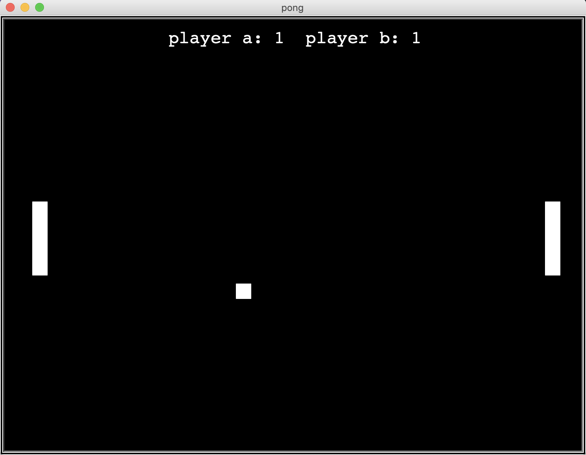

# pong
---- 
the classic pong game we all know and love, implemented in python3 using turtle.  
  
    
# how to run 
to run the program, navigate to the directory which contains pong.py and use the following command:  
<pre>python3 pong.py</pre>  
  
  
  
# player 1 controls 
----  
press e to move paddle up  
press d to move paddle down 
  
  
# player 2 controls    
press up arrow to move paddle up  
press down arrow to move paddle down 
  
    

  
    
      
        
        
  
# enjoy playing! 
